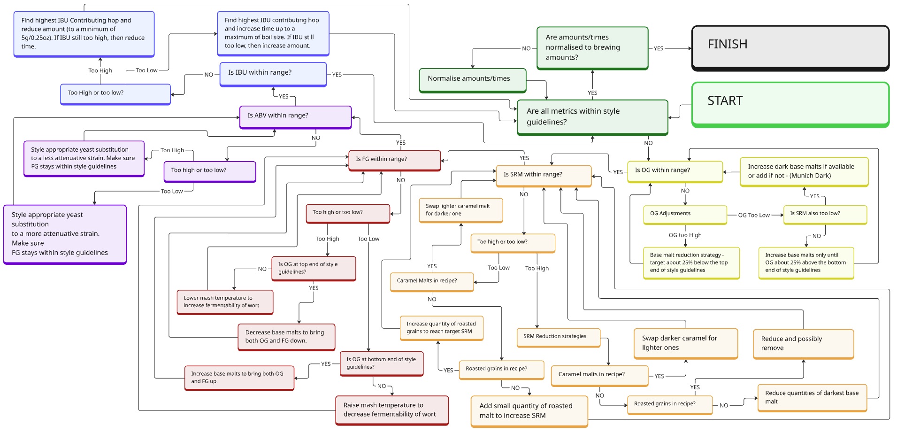

# 🍺 BrewTracker

A comprehensive brewing management application that helps homebrewers create, manage, and track their beer recipes and brewing sessions.

## 🌟 About the Application

BrewTracker is a full-stack web application that enables homebrewers to:

- Create and manage beer recipes with detailed ingredients and metrics
- Calculate important brewing metrics (OG, FG, ABV, IBU, SRM)
- Track brewing sessions and fermentation progress
- Analyze yeast performance with real-world attenuation data
- Browse and share recipes with advanced search and filtering
- Get AI-powered recipe suggestions for style compliance and optimization
- Share recipes publicly with proper attribution and access control
- View recipe statistics and brewing history

## 🏗️ Project Structure

This repository contains two applications:

- 🖥️ A frontend React App - User interface for recipe management
- 🔌 A backend Flask API - Python-based server handling recipe calculations and data storage

```
BrewTracker/
├── backend/
│   ├── app.py                                            # Flask application factory with auto-seeding, CORS, and blueprint registration
│   ├── config.py                                         # Environment-specific configuration classes (development, testing, production)
│   ├── data/                                             # Static JSON data files for ingredients, beer style guides, and system users
│   ├── models/                                           # Database models
│   │   ├── __init__.py
│   │   └── mongo_models.py                               # MongoEngine ODM models with validation, relationships, and business logic
│   ├── routes/                                           # Flask blueprints for API endpoints
│   │   ├── __init__.py
│   │   ├── ai_routes.py                                  # Automated recipe analysis and suggestion generation endpoints
│   │   ├── attenuation_analytics.py                      # Real world yeast attenuation analysis and statistics endpoints
│   │   ├── auth.py                                       # User authentication and authorization endpoints
│   │   ├── beer_styles.py                                # Beer style guide and analysis endpoints
│   │   ├── beerxml.py                                    # BeerXML import/export functionality endpoints
│   │   ├── brew_sessions.py                              # Brew session tracking and fermentation management endpoints
│   │   ├── ingredients.py                                # Ingredient CRUD operations, search endpoints, and yeast attenuation analytics
│   │   ├── recipes.py                                    # Recipe CRUD operations and calculation endpoints
│   │   └── user_settings.py                              # User preferences, account management, and secure account deletion endpoints
│   ├── seeds/                                            # Database seeding scripts
│   │   ├── seed_ingredients.py                           # Seeds ingredients from JSON data
│   │   ├── seed_beer_styles.py                           # Seeds beer style guides from JSON data
│   │   └── seed_system_users.py                          # Seeds system users for account deletion and community features
│   ├── services/                                         # Business logic layer
│   │   ├── __init__.py
│   │   ├── ai/                                           # AI recipe analysis and optimization services
│   │   │   ├── __init__.py                               # Package initialization with clean imports for all AI components
│   │   │   ├── flowchart_ai_service.py                   # Service wrapper for flowchart-based analysis to ensure compatibility with the current frontend expectations
│   │   │   ├── flowchart_engine.py                       # Provides the core engine that performs recipe analysis and optimization using a flowchart-based approach
│   │   │   ├── flowchart_nodes.py                        # Provides the core node types for executing flowchart-based recipe optimization workflows
│   │   │   ├── optimization_strategies.py                # Provides concrete implementations of optimization strategies that can be executed by the FlowchartEngine workflow nodes
│   │   │   ├── recipe_context.py                         # Maintains recipe state throughout workflow execution, handles condition evaluation and strategy execution
│   │   │   ├── workflow_config_loader.py                 # Provides utilities for loading and managing workflow configurations from YAML and JSON files
│   │   │   └── workflows/
│   │   │       ├── AI_flowchart.png                      # Graphical representation of the AI recipe analysis flowchart (showcased in README)
│   │   │       └── recipe_optimization.yaml              # Configuration file for recipe analysis flowchart. Defines all nodes and paths
│   │   ├── attenuation_service.py                        # Service for collecting and analyzing real-world yeast attenuation data
│   │   ├── google_oauth_service.py                       # Google OAuth verification service for BrewTracker
│   │   ├── ingredient_lookup_service.py                  # Provides centralized ingredient search, matching, and substitution logic for the AI optimization system.
│   │   ├── mongodb_service.py                            # Database abstraction layer with connection management and query utilities
│   │   └── user_deletion_service.py                      # Comprehensive user account deletion with data preservation options
│   ├── tests/                                            # pytest test suite for backend functionality
│   ├── utils/                                            # Utility functions and security components
│   │   ├── __init__.py
│   │   ├── brewing_calculation_core.py                   # Pure brewing mathematics (OG, FG, ABV, IBU, SRM calculations) - centralized calculation logic used by all services
│   │   ├── crypto.py                                     # Secure cryptographic utilities for password reset tokens with HMAC-SHA256
│   │   ├── error_handlers.py                             # Centralized error handling with security-conscious information disclosure prevention
│   │   ├── geolocation_service.py                        # Secure HTTPS geolocation service with multiple providers and fallback mechanisms
│   │   ├── input_sanitization.py                         # Multi-layer input sanitization for different data types with XSS protection
│   │   ├── rate_limiter.py                               # Configurable rate limiting framework with Redis support and endpoint-specific limits
│   │   ├── recipe_orm_calculator.py                      # Recipe calculations integrated with MongoDB models and validation
│   │   ├── recipe_api_calculator.py                      # Real-time recipe calculations for API endpoints without database persistence - also used by AI services
│   │   ├── request_validation.py                         # Comprehensive request validation with size limits, field requirements, and security checks
│   │   ├── security_headers.py                           # HTTP security headers (HSTS, CSP, X-Frame-Options, XSS protection, cache control)
│   │   ├── security_monitor.py                           # Real-time security monitoring with brute force detection, audit logging, and alerting
│   │   └── unit_conversions.py                           # Metric/imperial conversion utilities for weight, volume, and temperature
│   ├── requirements.txt                                  # Python package dependencies for backend
│   └── .env                                              # Environment variables for database URI, JWT secrets, and Flask configuration
├── frontend/
│   ├── craco.config.js                                   # CRACO configuration for webpack path alias resolution
│   ├── scripts/
│   │   └── sync-version.js                               # Automated script to sync version constant with package.json
│   ├── public/
│   │   ├── index.html                                    # Main HTML template for React application
│   ├── src/
│   │   ├── components/
│   │   │   ├── BeerXML/                                  # BeerXML import/export components with ingredient matching and validation
│   │   │   ├── BrewSessions/                             # Brew session management with fermentation tracking and progress monitoring
│   │   │   ├── Layout/
│   │   │   │   ├── Footer.tsx                            # A multi-column footer with project links, help resources, and legal information
│   │   │   │   ├── Header.tsx                            # Header component for BrewTracker with the main navigation bar, including logo, navigation links, and user actions
│   │   │   │   └── Layout.tsx                            # Layout component that provides a consistent page structure with a header, main content area, and footer
│   │   │   ├── RecipeBuilder/                            # Complex recipe creation interface with real-time calculations, ingredient management, and AI suggestions
│   │   │   ├── CompactRecipeCard.tsx                     # Unified recipe display component with SRM color swatches, metrics grid, and action filtering
│   │   │   ├── GoogleSignInButton.tsx                    # FedCM-compatible Google Sign-In component with modern authentication support
│   │   │   ├── RecipeActions.tsx                         # Action buttons for recipe operations with public recipe access control (edit, delete, clone, share)
│   │   │   └── SearchableSelect.ts                       # Fuzzy search component with Fuse.js for intelligent ingredient matching and suggestions
│   │   ├── constants/
│   │   │   └── version.ts                                # Application version constant, automatically synchronized with package.json
│   │   ├── contexts/
│   │   │   └── UnitContext.ts                            # React context for global metric/imperial unit preference management
│   │   ├── hooks/                                        # Custom React hooks for state management and business logic
│   │   │   ├── index.ts                                  # Central export for all custom hooks
│   │   │   └── useRecipeBuilder.ts                       # Recipe builder state management and validation logic
│   │   ├── reducers/                                     # Redux-style reducers for complex state management
│   │   │   ├── aiSuggestionsReducer.ts                   # AI recipe suggestions state management with optimization tracking
│   │   │   ├── beerXMLReducer.ts                         # BeerXML import/export workflow state management
│   │   │   ├── brewSessionReducer.ts                     # Brew session tracking and fermentation state management
│   │   │   ├── fermentationReducer.ts                    # Detailed fermentation data and progress tracking
│   │   │   ├── ingredientManagerReducer.ts               # Ingredient database management and search state
│   │   │   ├── recipeBuilderReducer.ts                   # Complex recipe creation and editing state management
│   │   │   ├── userSettingsReducer.ts                    # User preferences and account settings state management
│   │   │   └── index.ts                                  # Central export for all reducers
│   │   ├── images/                                       # Static image assets (logos, icons, placeholders)
│   │   ├── pages/
│   │   │   ├── About.tsx                                 # An "About Me" page so you can learn all about me
│   │   │   ├── AllRecipes.tsx                            # Personal recipe library with advanced fuzzy search and recipe sorting
│   │   │   ├── AttenuationAnalytics.tsx                  # Yeast attenuation analytics dashboard with real-world performance data
│   │   │   ├── Dashboard.tsx                             # User dashboard with recent activity, quick stats, and navigation shortcuts
│   │   │   ├── FAQ.tsx                                   # A categorized list of frequently asked questions with expandable answers
│   │   │   ├── FeatureRequest.tsx                        # Renders a form for users to submit feature requests for the BrewTracker application. Submissions are passed to GitHub.
│   │   │   ├── Help.tsx                                  # Help page component that provides a comprehensive user guide for BrewTracker
│   │   │   ├── IngredientManager.tsx                     # Ingredient database management with creation, editing, and bulk operations
│   │   │   ├── Login.tsx                                 # User authentication login page
│   │   │   ├── PrivacyPolicy.tsx                         # Privacy Policy for BrewTracker
│   │   │   ├── PublicRecipes.tsx                         # Community recipe sharing with unified design, search, sorting, style filtering, and access control
│   │   │   ├── RecipeBuilder.tsx                         # Create and edit recipes with ingredient management
│   │   │   ├── Register.tsx                              # User registration page with real-time username validation and account creation form
│   │   │   ├── ReportBug.tsx                             # A form for reporting bugs in BrewTracker which opens a pre-filled GitHub issue creation page in a new tab upon submission
│   │   │   ├── TermsOfService.tsx                        # Terms of Service for BrewTracker
│   │   │   ├── UserSettings.tsx                          # User preferences, account management, and secure account deletion with data preservation options
│   │   │   └── ViewRecipe.tsx                            # Detailed recipe view with calculations, brew sessions, and sharing options
│   │   ├── services/                                     # TypeScript service layer for API communication and business logic
│   │   │   ├── api.ts                                    # Low-level HTTP client with authentication and error handling
│   │   │   ├── index.ts                                  # Central export hub for all service modules
│   │   │   ├── CacheManager.ts                           # Client-side caching for improved performance
│   │   │   ├── Analytics/                                # Data analysis and insights
│   │   │   │   ├── AttenuationAnalyticsService.ts        # Yeast attenuation analytics and real-world performance data management
│   │   │   │   └── MetricService.ts                      # Recipe calculations (OG, FG, ABV, IBU, SRM) and analysis
│   │   │   ├── AI/                                       # AI recipe suggestion services
│   │   │   │    └── AiService.ts                         # Simplified AI Service for Backend API Communication
│   │   │   ├── BeerXML/                                  # BeerXML format handling services
│   │   │   │   ├── BeerXMLService.ts                     # BeerXML import/export and format conversion
│   │   │   │   └── IngredientMatchingService.ts          # Ingredient mapping and matching for BeerXML imports
│   │   │   ├── Brewing/                                  # Brewing process management
│   │   │   │   └── BrewSessionService.ts                 # Brew session tracking and fermentation data management
│   │   │   ├── Data/                                     # Core data management
│   │   │   │   ├── BeerStyleService.ts                   # Beer style matching and analysis against BJCP guidelines
│   │   │   │   ├── IngredientService.ts                  # Ingredient search, CRUD operations, and database management
│   │   │   │   └── RecipeService.ts                      # Recipe CRUD operations, cloning, sharing functionality, and public recipe access control
│   │   │   └── User/                                     # User-specific services
│   │   │       ├── RecipeDefaultsService.ts              # Default value generation based on user preferences and recipe type
│   │   │       └── UserSettingsService.ts                # User preferences, account management, and settings persistence
│   │   ├── styles/                                       # CSS for various frontend components
│   │   ├── types/                                        # Comprehensive TypeScript type definitions for BrewTracker
│   │   │   ├── api.ts                                    # API request/response interface definitions
│   │   │   ├── beer-styles.ts                            # Beer style guide and analysis type definitions
│   │   │   ├── beerxml.ts                                # Comprehensive BeerXML format handling and ingredient matching type definitions
│   │   │   ├── brew-session.ts                           # Brew session and fermentation tracking types
│   │   │   ├── common.ts                                 # Shared utility types and common interfaces
│   │   │   ├── globals.d.ts                              # Global TypeScript declarations and module augmentations
│   │   │   ├── index.ts                                  # Central export for all type definitions
│   │   │   ├── metrics.ts                                # Brewing calculation and measurement types
│   │   │   ├── recipe.ts                                 # Recipe, ingredient, and calculation type definitions
│   │   │   ├── units.ts                                  # Unit system and conversion type definitions
│   │   │   └── user.ts                                   # User account and settings type definitions
│   │   ├── utils/
│   │   │   └── formatUtils.ts                            # Utility functions for unit formatting and display
│   │   ├── App.tsx                                       # Main React application component with routing and global providers
│   │   └── index.tsx                                     # React application entry point and DOM rendering
│   ├── tests/                                            # Jest + TypeScript tests for React components and utilities
│   ├── package.json                                      # Node.js dependencies, scripts, and project configuration
│   └── .env                                              # Environment variables for API URLs and frontend configuration
├── LICENSE                                               # GNU GENERAL PUBLIC LICENSE Version 3
├── LICENSE-HEADER.txt                                    # License header for BrewTracker
└── README.md                                             # The document you are currently reading!
```

## 📋 Requirements

- Node.js (v22+)
- Python (v3.13+)
- MongoDB (v7.0+)
- TypeScript (v4.9+) - automatically installed with frontend dependencies

## 🚀 Quickstart

### 📥 Install Dependencies

1. Install Node.js using NVM:

```bash
brew install nvm
nvm install 22
```

2. Install Python 3.13:

```bash
brew install python@3.13
```

3. Install MongoDB:

```bash
brew tap mongodb/brew
brew install mongodb-community@7.0
```

### 🛠️ Set up your project

1. Clone the repository:

```bash
git clone https://github.com/jackmisner/BrewTracker.git
cd BrewTracker
```

2. Install dependencies:

```bash
# Frontend dependencies
cd frontend
npm install

# Backend dependencies
cd ../backend
python -m venv .venv
source .venv/bin/activate
pip install -r requirements.txt
```

3. Verify TypeScript setup:

```bash
# Check TypeScript compilation (from frontend directory)
cd frontend
npx tsc --noEmit
```

4. Start MongoDB:

```bash
brew services start mongodb-community
```

### ⚙️ Environment Setup

#### Frontend

Create `frontend/.env`:

```plaintext
REACT_APP_API_URL="http://localhost:5000/api"
REACT_APP_GOOGLE_CLIENT_ID="your-google-client-id.apps.googleusercontent.com"
```

#### Backend

Create `backend/.env`:

```plaintext
MONGO_URI="mongodb://localhost:27017/brewtracker"
JWT_SECRET_KEY="your_secret_key_here"
SECRET_KEY="your_flask_secret_key_here"
FLASK_APP="app.py"
FLASK_ENV="development"

# Security Configuration
PASSWORD_RESET_SECRET="your_password_reset_secret_here"  # Optional: Falls back to JWT_SECRET_KEY if not set

# Google OAuth Configuration
GOOGLE_CLIENT_ID="your-google-client-id.apps.googleusercontent.com"
GOOGLE_CLIENT_SECRET="your-google-client-secret"
```

### 🔐 Google Authentication Setup

BrewTracker supports Google Sign-In for seamless user authentication. To enable this feature:

#### 1. Create Google OAuth Credentials

1. Go to [Google Cloud Console](https://console.cloud.google.com/)
2. Create a new project or select an existing one
3. Enable the Google+ API
4. Go to **Credentials** → **Create Credentials** → **OAuth 2.0 Client ID**
5. Configure the OAuth consent screen
6. For **Application type**, select **Web application**
7. Add your authorized domains:
   - **Authorized JavaScript origins**:
     - `http://localhost` (for development)
     - `http://localhost:3000` (for development)
     - `https://your-production-domain.com` (for production)
   - **Authorized redirect URIs**:
     - `http://localhost:3000` (for development)
     - `https://your-production-domain.com` (for production)

#### 2. Configure Environment Variables

Add your Google OAuth credentials to both frontend and backend `.env` files:

- **Frontend**: `REACT_APP_GOOGLE_CLIENT_ID` (Client ID only, no secret needed)
- **Backend**: `GOOGLE_CLIENT_ID` and `GOOGLE_CLIENT_SECRET` (both values)

#### 3. Features

- **Sign In with Google**: Users can authenticate using their Google account
- **Sign Up with Google**: New users can create accounts instantly
- **Account Linking**: Existing users can link their Google account to their local account
- **Secure Authentication**: Server-side token verification with Google's API
- **JWT Integration**: Google authentication integrates seamlessly with existing JWT tokens
- **FedCM Compatibility**: Modern Google Sign-In implementation using Federated Credential Management (FedCM) APIs

### 📦 Database Setup

No explicit database setup commands are needed for MongoDB.
When you first start the application:

1. MongoDB will automatically create the database and collections as needed
2. The application will check if ingredient data exists
3. If no ingredients are found, it will automatically seed the database with initial ingredient data from `backend/data/brewtracker.ingredients.json` using `backend/seeds/seed_ingredients.py`
4. Similarly, beer style guides will be seeded from `backend/data/beer_style_guides.json` using `backend/seeds/seed_beer_styles.py`
5. System users (Anonymous User, BrewTracker System, Community) will be seeded from `backend/data/system_users.json` using `backend/seeds/seed_system_users.py` to support account deletion and community features

To manually verify your MongoDB setup:

```bash
# Start the MongoDB shell
mongosh

# Switch to your database
use brewtracker

# Verify collections
show collections
```

## 🏃‍♂️ Running the Application

1. Start the backend server:

```bash
cd backend
source .venv/bin/activate  # Activate virtual environment
flask run
```

2. In a new terminal, start the frontend:

```bash
cd frontend
npm start
```

Visit `http://localhost:3000` to access the application.

## 🔑 Features

- 📝 Recipe Creation and Management

  - Add/edit/delete recipes with comprehensive ingredient management
  - Automatic metric calculations with real-time updates
  - Recipe cloning with version control and parent-child relationships
  - Advanced recipe browsing with fuzzy search and 14 sorting criteria
  - Unified compact recipe cards with SRM color visualization
  - AI-powered recipe suggestions for style compliance and optimization
  - Public recipe access control with attribution and unlinked cloning

- 📊 Brewing Metrics & Analytics

  - Core brewing calculations: Original Gravity (OG), Final Gravity (FG), Alcohol By Volume (ABV)
  - Hop calculations: International Bitterness Units (IBU) with multiple hop addition types
  - Colour analysis: Standard Reference Method (SRM) with accurate beer colour representation
  - Yeast Attenuation Analytics: Real-world yeast performance tracking with min/max/average attenuation rates

- 🔄 Brew Session Tracking

  - Track fermentation progress with detailed logging
  - Record brewing notes and process observations
  - Monitor temperature and fermentation conditions
  - Link brew sessions to recipes for performance analysis

- 🌐 Community Features

  - Public/private recipe visibility with sharing controls and access management
  - Community recipe library with advanced search and filtering
  - Recipe cloning from public submissions with proper attribution
  - User attribution and recipe discovery
  - Unlinked public recipe cloning for independent recipe development

- 🔧 Advanced Tools

  - BeerXML import/export for recipe portability
  - Beer style analysis against BJCP guidelines
  - Ingredient database management with search capabilities
  - Metric/Imperial unit conversion and user preferences
  - AI recipe suggestions with style compliance optimization and intelligent ingredient recommendations

- 👥 User Experience
  - Secure JWT-based authentication with Google Sign-In support
  - Google OAuth integration for seamless account creation and login with FedCM compatibility
  - Account linking between local and Google accounts
  - Real-time username validation with availability checking and intelligent suggestions
  - Secure account deletion with data preservation options for community contributions
  - Responsive design optimized for desktop and mobile
  - Real-time recipe calculations and validation
  - Comprehensive search with Fuse.js fuzzy matching

- 🔒 Security & Privacy
  - **Comprehensive Security Hardening**: Complete OWASP Top 10 vulnerability protection
  - **Rate Limiting**: Intelligent rate limiting with configurable limits per endpoint type
  - **Input Validation**: Multi-layer input sanitization with XSS and injection protection
  - **Security Headers**: Full HTTP security headers (HSTS, CSP, X-Frame-Options, etc.)
  - **Secure Authentication**: HMAC-SHA256 password reset tokens and JWT security
  - **Real-time Monitoring**: Brute force detection and security event logging
  - **Production Security**: Enhanced production configuration with secret validation
  - **HTTPS Services**: Secure geolocation services with multiple provider fallback
  - **Error Handling**: Security-conscious error responses preventing information disclosure

## 🤖 AI Recipe Analysis Engine

BrewTracker features a sophisticated AI-powered recipe analysis engine that provides intelligent brewing suggestions and optimization recommendations. The engine uses a flowchart-based approach to systematically analyze recipes and provide actionable improvements.

### Flowchart-Based Analysis System



_The comprehensive AI recipe analysis flowchart showing decision trees for IBU optimization, ABV/FG adjustments, SRM color balancing, OG targeting, and ingredient normalization._

The AI engine follows a structured workflow that:

1. **Analyzes Recipe Composition**: Evaluates ingredient ratios, base malt percentages, and overall recipe structure
2. **Checks Style Compliance**: Compares recipes against BJCP style guidelines for accuracy and authenticity
3. **Identifies Optimization Opportunities**: Detects areas for improvement in grain bills, hop schedules, and yeast selection
4. **Generates Intelligent Suggestions**: Provides specific, actionable recommendations with predicted impacts
5. **Validates Improvements**: Ensures suggestions maintain recipe integrity and brewing feasibility

### Key AI Features

- **Smart Base Malt Selection**: Style-aware malt recommendations (e.g., Pilsner for German lagers, 2-Row for American IPAs)
- **Comprehensive Style Compliance**: Multi-metric optimization targeting OG, FG, ABV, IBU, and SRM ranges
- **Automatic Color Adjustment**: Intelligent addition of color malts like Blackprinz when SRM is below style minimum
- **Hop Timing Optimization**: IBU-focused timing adjustments with conservative brewing practices
- **Ingredient Normalization**: Rounds ingredients to brewing-friendly increments (25g/0.5oz steps)
- **Cascading Effects Prediction**: Accurately predicts how changes affect all recipe metrics

### Technical Implementation

The AI system is built using:

- **Flowchart Engine**: Configurable YAML-based workflow execution (`backend/services/ai/flowchart_engine.py`)
- **Optimization Strategies**: Modular brewing science algorithms (`backend/services/ai/optimization_strategies.py`)
- **Recipe Context Management**: Stateful recipe analysis with condition evaluation (`backend/services/ai/recipe_context.py`)
- **BJCP Integration**: Complete beer style guide integration for accurate style matching
- **Real-time Calculations**: Instant metric updates using brewing calculation engine

### Quality Control

The system includes stringent quality checks:

- ✅ **Full Compliance Validation**: Only shows "Recipe Analysis Complete" when ALL style metrics are within BJCP ranges
- 🔍 **Manual Review Indicators**: Alerts when improvements are needed but can't be auto-generated
- ⚖️ **Base Malt Requirements**: Ensures base malts constitute ≥55% of grain bill
- 🎯 **Conservative Adjustments**: Prefers safe, proven brewing techniques over aggressive changes

## 🔐 System Users Architecture

BrewTracker implements a sophisticated system users architecture to handle account deletion while preserving community contributions. This ensures that when users delete their accounts, valuable public recipes remain accessible to the brewing community.

### System User Types

- **Anonymous User** (`anonymous@brewtracker.system`): Receives public recipes from deleted accounts to maintain community access while protecting user privacy
- **BrewTracker System** (`system@brewtracker.system`): Handles automated processes, system-generated content, and administrative functions
- **Community** (`community@brewtracker.system`): Represents community-contributed recipes, shared templates, and collaborative brewing content

### Account Deletion Features

- **Data Preservation Choice**: Users can choose to preserve public recipes for the community or delete everything
- **Secure Deletion Process**: Multi-step confirmation with password verification and "DELETE" confirmation
- **Attribution Transfer**: Public recipes are transparently transferred to "Anonymous User" with proper attribution
- **Complete Privacy**: All private data, personal recipes, and brew sessions are permanently deleted
- **System Protection**: System users cannot be deleted, ensuring platform integrity

### Technical Implementation

- **Automatic Seeding**: System users are automatically created from `backend/data/system_users.json` on first run
- **Service Integration**: `UserDeletionService` handles comprehensive account deletion with data preservation options
- **Database Integrity**: Validates system user existence before allowing account deletions
- **Audit Logging**: All deletion operations are logged for security and compliance purposes

## 💻 Tech Stack

- Frontend:

  - React 19 with TypeScript
  - React Router
  - Axios
  - Fuse.js for fuzzy searching
  - TypeScript for type safety
  - Jest for testing
  - CRACO for webpack configuration override
  - Path aliases (`@/`) for clean imports

- Backend:
  - Flask with comprehensive security hardening
  - MongoEngine & PyMongo
  - JWT Authentication with secure token handling
  - MongoDB with production-ready security configuration
  - Rate limiting with Flask-Limiter
  - Input validation and sanitization with Marshmallow
  - Security monitoring and audit logging
  - HTTPS geolocation services with fallback mechanisms

## 🧪 Development & Testing

### Test Coverage Overview

- **Frontend**: 1,849 tests with Jest and React Testing Library
- **Backend**: 473+ tests with pytest and mongomock (includes security component tests)
- **Coverage Target**: 70% minimum for both frontend and backend
- **Security Testing**: Comprehensive security component testing including cryptographic utilities, rate limiting, input validation, and geolocation service mocking
- **Total Test Suite**: End-to-end testing including component, service, security, and integration tests

### Frontend Testing

```bash
cd frontend

# Run all tests (1,849 tests)
npm test

# Run tests with coverage reporting
npm run coverage

# TypeScript type checking
npx tsc --noEmit

# Run specific test file
npm test -- --testPathPattern=CompactRecipeCard
```

### Backend Testing

```bash
cd backend
source .venv/bin/activate  # Activate virtual environment first

# Run all tests (473+ tests including security components)
pytest

# Run tests with coverage reporting (recommended)
pytest --cov

# Run specific test modules
pytest tests/test_ingredients.py
pytest tests/test_auth.py tests/test_crypto_utils.py  # Security tests

# Run tests with verbose output
pytest --cov -v

# Note: Parallel execution (pytest -n auto) may cause issues due to 
# security monitoring components and shared database state
```

**Important**: Always activate your virtual environment (`.venv`) before running tests. The security implementation includes new dependencies (`marshmallow`, `Flask-Limiter`) that must be installed in your virtual environment.

**Security Testing**: The test suite now includes comprehensive security component testing including geolocation service mocking (London, UK), cryptographic utilities, rate limiting, and input validation.

### Version Management

The frontend uses automated version synchronization to keep the displayed version in sync with `package.json`:

```bash
# Bump version and automatically update version constant
npm run version:patch   # 1.7.10 -> 1.7.11
npm run version:minor   # 1.7.10 -> 1.8.0  
npm run version:major   # 1.7.10 -> 2.0.0

# Manually sync version constant if needed
npm run sync-version
```

The version is displayed in the footer and automatically updates when using npm version commands.

### Path Aliases & Clean Imports

The project uses TypeScript path aliases configured via CRACO for clean, maintainable imports:

```typescript
// ✅ Clean aliases (preferred)
import { Services } from "@/services";
import { Recipe } from "@/types";
import { useRecipeBuilder } from "@/hooks/useRecipeBuilder";
import { APP_VERSION } from "@/constants/version";

// ❌ Relative imports (avoided)
import { Services } from "../../../services";
import { Recipe } from "../../types";
```

**Configured aliases:**
- `@/components/*` → `src/components/*`
- `@/services/*` → `src/services/*`  
- `@/hooks/*` → `src/hooks/*`
- `@/types/*` → `src/types/*`
- `@/constants/*` → `src/constants/*`
- And more...

### Quality Assurance

- **TypeScript**: Strict type checking across all frontend code
- **ESLint**: Code quality and consistency enforcement
- **Black + isort**: Python code formatting and import organization
- **CI/CD**: Automated testing on push and pull requests
- **Coverage Reports**: Integrated with Codecov for tracking

## 📄 License

BrewTracker is free software licensed under the **GNU General Public License v3.0 or later**.

This ensures that:

- ✅ The software remains **completely free** for all homebrewers
- ✅ Any improvements must be **shared back** with the brewing community
- ✅ Commercial derivatives must **also be open source**
- ✅ Brewing knowledge and calculations **stay accessible** to everyone

### What this means for you:

- **Homebrewers**: Use freely, modify for your needs, share improvements
- **Brewing Clubs**: Customize for your group and contribute back enhancements
- **Developers**: Contribute code improvements that benefit all brewers
- **Commercial Users**: Can use internally but must release any modifications

See the [GPL v3 License](https://www.gnu.org/licenses/gpl-3.0.html) for complete details.

## 🤝 Contributing

Contributions are welcome! Please feel free to submit a Pull Request.

By contributing to BrewTracker, you agree that your contributions will be licensed under the same GPL v3 license.

### Development Guidelines

- All new frontend code should be written in TypeScript
- All new frontend tests should be written in TypeScript (.test.ts/.test.tsx)
- Maintain test coverage above 70%
- Run type checking before committing: `npx tsc --noEmit`
- Follow existing code conventions and patterns
